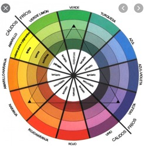

## combinacion-de-colores-resolucion

Créditos a @diegosedlaruk quien rindió el parcial, se hicieron pequeñas correcciones.

# Enunciado
Queremos analizar información relacionada con prendas de ropa y validar qué tan buen gusto tenemos para combinarlas, para lo cual obviamente decidimos hacer un programa en Prolog que nos dé una mano. Para ello tenemos la siguiente base de conocimientos: <br>


```prolog
% precio(tipo de prenda, tela de la prenda, precio de venta)
% los tipos de tela son: estampado(patron, lista de colores que tiene) o 
% liso(color)
precio(remera, estampado(floreado, [rojo, verde, blanco]), 500).
precio(remera, estampado(rayado, [verde, negro, rojo]), 600).
precio(buzo, liso(azul), 1200).
precio(vestido, liso(negro), 3000).
precio(saquito, liso(blanco), 1500).

paleta(sobria, negro).	
paleta(sobria, azul).  	
paleta(sobria, blanco).        
paleta(sobria, gris).
paleta(alegre, verde).	
paleta(alegre, blanco).  
paleta(alegre, amarillo).
paleta(furiosa, rojo).  
paleta(furiosa, violeta).  
paleta(furiosa, fucsia).
```
Definir los siguientes predicados de modo que sean **totalmente inversibles** a menos que se indique lo contrario en ese punto:

1. coloresCombinables/2 relaciona dos colores distintos si se encuentran en una misma paleta o si uno de ellos es el negro, que puede combinarse con cualquier otro.
```prolog
coloresCombinables(negro,blanco).
true
```
2. colorinche/1 se cumple para un functor prenda/2 si la tela de la misma es estampada y no tiene dos colores que pertenezcan a una misma paleta.
```prolog
?- colorinche(Prenda).
Prenda = prenda(remera, estampado(rayado, [verde, negro, rojo])) 
```
3. colorDeModa/1 se cumple para un color si todas las prendas estampadas a la venta tienen ese color.
```prolog
?- colorDeModa(Color).
Color = verde. 
```
4. combinan/2 relaciona dos prendas si sus telas quedan bien juntas, lo cual se cumple si las dos son lisas y los colores son combinables, o si una es estampada y la otra lisa y alguno de los colores de la estampa es combinable con el color de la tela lisa. No quedan bien dos telas estampadas juntas.
```prolog
?- combinan(Prenda1, Prenda2).
   Prenda1 = prenda(vestido, liso(negro)), 
   Prenda2 = prenda(saquito, liso(blanco));
   Prenda1 = prenda(remera, estampado(floreado,[rojo,verde,blanco])), 
   Prenda2 = prenda(saquito, liso(blanco));
```
5. precioMaximo/2 relaciona un tipo de prenda con su precio máximo de todas las prendas a la venta de ese mismo tipo.
```prolog
?- precioMaximo(remera, Precio).
Precio = 600. 
```
6. conjuntoValido/1 dada una lista de prendas, se considera un conjunto válido si todas las que la componen combinan con todas las otras y tiene al menos dos elementos.
**No se requiere que sea inversible.**
```prolog
?- conjuntoValido([prenda(vestido, estampado(rayado, [negro,blanco])), prenda(saquito, liso(gris))]).
true
?- conjuntoValido([prenda(saquito, liso(amarillo)), prenda(remera, liso(fucsia)), prenda(pantalon, liso(negro))]).
false
```
